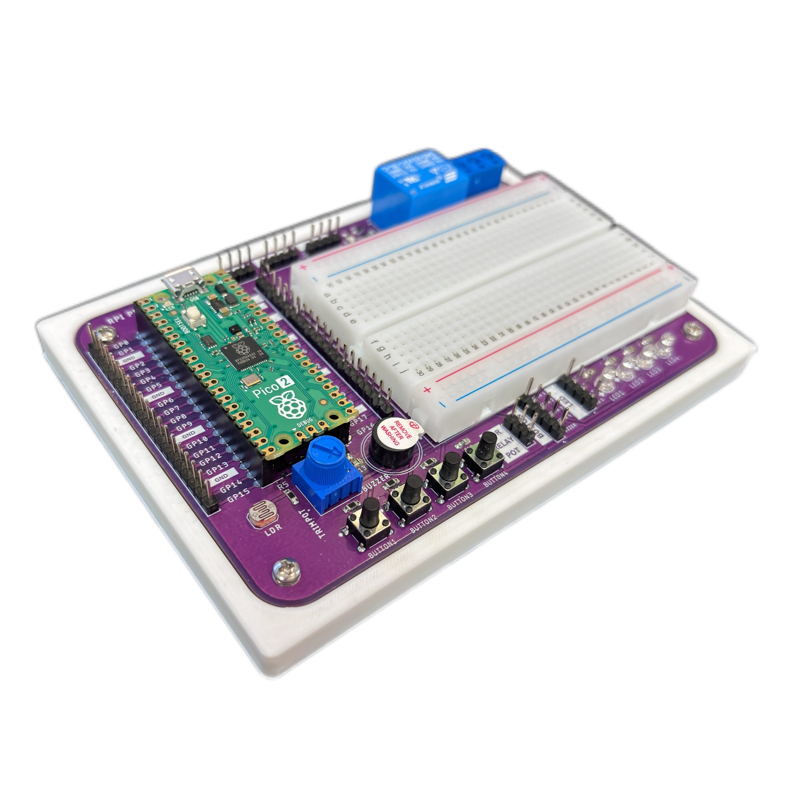
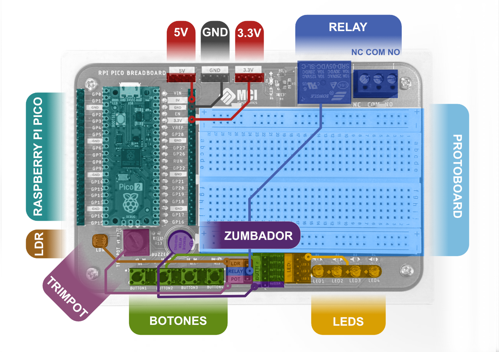
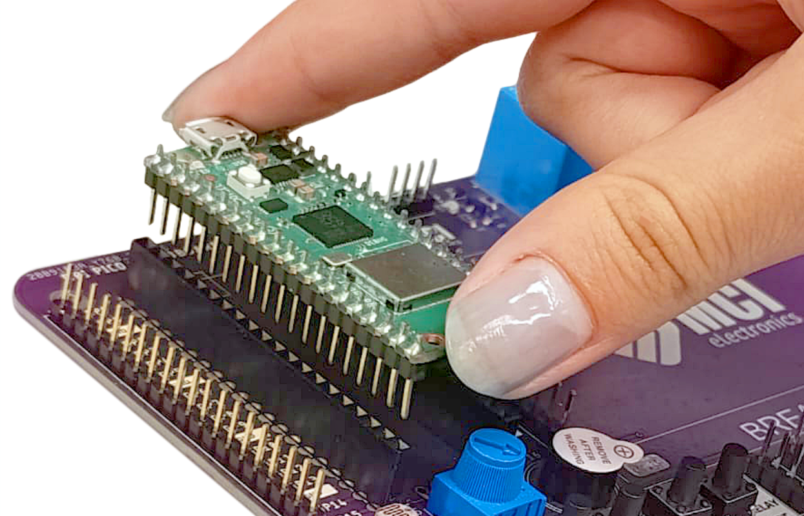
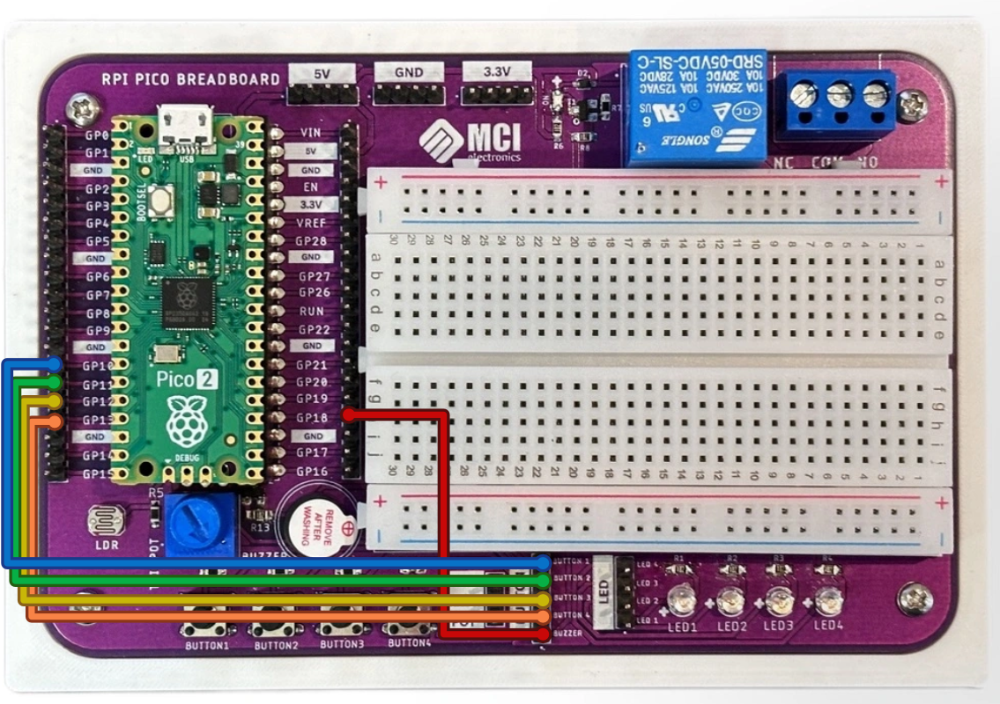
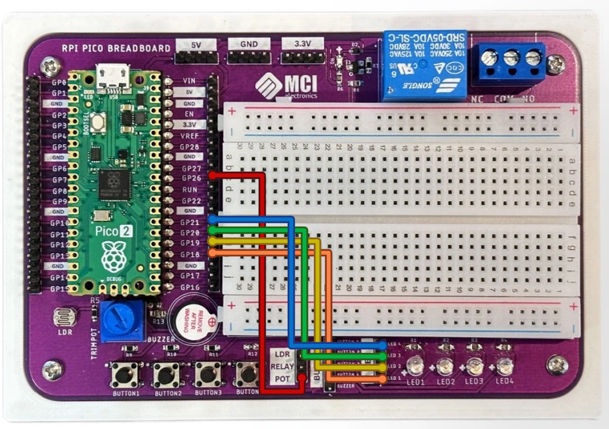
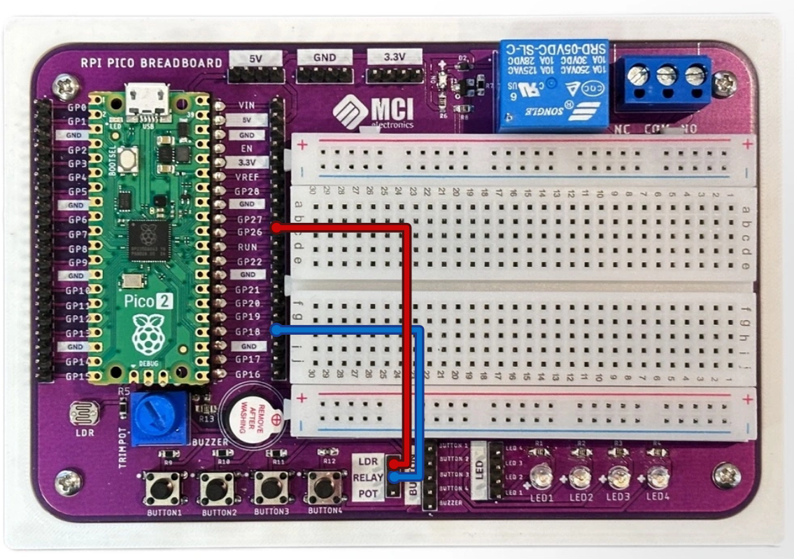

# Rpi Pico Breadboard



Este kit de protoboard para **[Raspberry Pi Pico](https://mcielectronics.cl/shop/product/kit-de-inicio-raspberry-pi-pico-30215/)** es la opción ideal para quienes quieren aprender, experimentar o crear proyectos electrónicos sin complicaciones. Combina los componentes más utilizados para el aprendizaje más un área de prototipado.

Diseñado para que puedas conectar tu Raspberry Pi Pico directamente, el kit cuenta con un socket compatible con la  Raspberry pi Pico, Pico W, Pico2 y Pico2W además de un espacio para la protoboard de 400pts incluida. Los pines GPIO del Pico se extienden a ambos lados para facilitar las conexiones con los cables incluidos, y la parte superior ofrece pines dedicados de 5V, 3.3V y GND para una conexión rápida y ordenada.

## Características principales

- 100% compatible con [Raspberry Pi Pico](https://mcielectronics.cl/shop/product/kit-de-inicio-raspberry-pi-pico-30215/), [Pico2](https://mcielectronics.cl/shop/product/kit-de-inicio-raspberry-pi-pico-2/), [PicoW](https://mcielectronics.cl/shop/product/kit-de-inicio-raspberry-pi-pico-w-con-conexion-wifi/), [Pico2W](https://mcielectronics.cl/shop/product/74358/)
- No requiere soldadura
- Incluye protoboard de 400pts
- Pines GPIO expuestos con rieles de alimentación dedicados (5V, 3.3V y GND)
- Buzzer, Potenciometro, LDR, Relay, 4 LEDs y 4 botones integrados
- Agujeros de montaje M2.5
- Dimensiones: 145 mm x 80 mm

## Componentes y conexiones




## Empezando a usar la tarjeta Rpi Pico Breadboard

### Requerimientos de hardware

- Computador.
- [Raspberry Pi Pico](https://mcielectronics.cl/shop/product/kit-de-inicio-raspberry-pi-pico-30215/) con headers u otro microcontrolador compatible.
- Cable USB compatible con nuestro microcontrolador.

### Requerimientos de software
- [Thonny](https://thonny.org/)

### Cómo conectar Raspberry Pi Pico a la tarjeta

Para poder utilizar la tarjeta Rpi Pico Breadboard primero es necesario conectarle una Raspberry Pi Pico. Para esto, es necesario asegurarse de que la tarjeta Pi Pico tiene headers macho soldados. Con esto listo, debería calzar dentro de los headers hembra de la tarjeta, como se ve a continuación:



## Ejemplo 1: Botón y Buzzer

El primer ejemplo utiliza los cuatro botones integrados como un piano junto al buzzer: Cada botón reproduce una nota distinta.

### Conexiones



### Código

```python
from machine import Pin, ADC, PWM
import time

# Definimos los botones
BOT1= Pin(10, Pin.IN, Pin.PULL_UP)
BOT2= Pin(11, Pin.IN, Pin.PULL_UP)
BOT3= Pin(12, Pin.IN, Pin.PULL_UP)
BOT4= Pin(13, Pin.IN, Pin.PULL_UP)

BUZZER= PWM(Pin(18)) # Pin del zumbador

def tone(frequencia, duracion): 
    BUZZER.freq(frequencia)
    BUZZER.duty_u16(10000)
    time.sleep_ms(duracion)
    BUZZER.duty_u16(0)
    
try:
    while True:
        if BOT1.value()==1:
            tone(440, 100)
        if BOT2.value()==1:
            tone(494, 100)
        if BOT3.value()==1:
            tone(523, 100)
        if BOT4.value()==1:
            tone(570, 100)
except KeyboardInterrupt:
    print("Prueba interrumpida.")
```

## Ejemplo 2: Leds y Potenciómetro

Este ejemplo cambia la intensidad del brillo de los LEDs con el potenciómetro. Al mismo tiempo se puede leer el valor del potenciómetro en el monitor serial. Mientras este valor sea mayor, más brillan los LEDs.

### Conexiones



### Código

```python
from machine import Pin, PWM, ADC
import time

LED1= PWM(Pin(18))
LED2= PWM(Pin(19))
LED3= PWM(Pin(20))
LED4= PWM(Pin(21))
LEDS = {LED1, LED2, LED3, LED4}
POT= ADC(26)
frequency = 5000
for led in LEDS:
    led.freq(frequency)
try:
    while True:
        valorPot = POT.read_u16()
        print(f"Potenciómetro:  {valorPot:.2f}")
        brillo= valorPot-190
        if brillo<0:
            brillo=0
        for led in LEDS:
            led.duty_u16(brillo)
        time.sleep(0.1)
except KeyboardInterrupt:
    print("Prueba interrumpida.")
```

## Ejemplo 3: LDR y Relay

Este último ejemplo enciende el relé cuando el valor que entrega la fotorresistencia es menor que el de un umbral que definimos. Se debe escuchar un clickeo cuando se enciende o apaga el relé.

### Conexiones



### Código

```python
from machine import Pin, ADC
import time

RELAY= Pin(18, Pin.OUT)
LDR= ADC(26)
umbral= 30000
try:
    while True:
        valorLDR = LDR.read_u16()
        print(f"LDR:  {valorLDR:.2f}")
        if valorLDR < umbral:
            RELAY.value(1)
        else:
            RELAY.value(0)
        time.sleep(0.1)
except KeyboardInterrupt:
    print("Prueba interrumpida.")
```
 Test 6515123